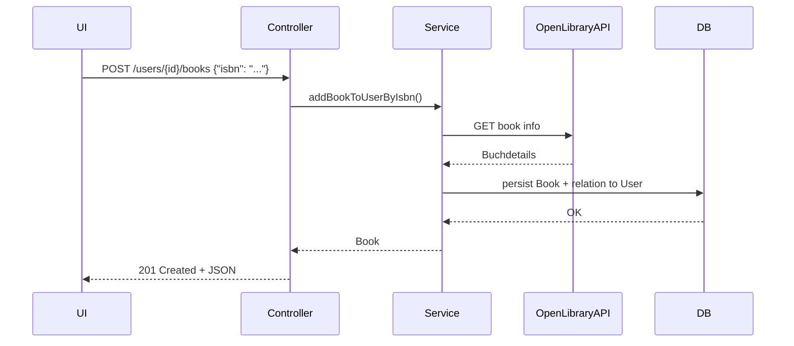

# BookManager – Systemarchitektur-Dokumentation

## 1. Überblick
Der **BookManager** ist ein webbasiertes Spring Boot System zur Verwaltung persönlicher Buchsammlungen inklusive Bewertungen und Rezensionen. Es unterstützt sowohl Datenimport von der OpenLibrary API als auch manuelle Bearbeitung durch den Benutzer.

---

## 2. Architekturüberblick

Das System folgt einer klassischen **3-Schichten-Architektur**:

- **Controller Layer**: Zuständig für REST-Endpunkte und HTTP-Logik.
- **Service Layer**: Enthält Geschäftslogik, externe API-Kommunikation und Validierungen.
- **Persistence Layer (Repository)**: Verwaltet Datenbankzugriffe via JPA.

---

## 3. Paketstruktur

```
at.fhburgenland.bookmanager
│── controller             # REST-Controller (Book, Review, User)
│── service                # Geschäftslogik
│── repository             # JPA-Repositories (User, Book, Review)
│── model                  # Datenbank-Entities
│── dto                    # Datenübertragungsobjekte (IsbnRequest, RatingUpdateRequest etc.)
│── exception              # Fehlerbehandlung & globale ExceptionHandler
│── BookmanagerApplication # Main-Klasse (Spring Boot)
```

---

## 4. Datenfluss (Beispiel: Buch per ISBN hinzufügen)



---

## 5. Deployment & Betrieb

### Deployment Steps

- Projekt wird als Fat Jar (`spring-boot-maven-plugin`) gebaut.
- Dockerfile vorhanden zur Containerisierung.
- Deployment auf beliebigem Docker-fähigen Host möglich (z. B. Heroku, Railway, EC2, Render).

---

## 6. Integrationen

- **OpenLibrary API** – zum Abrufen von Buchdaten (via ISBN)
- **Spring Boot** – als Framework
- **H2 / PostgreSQL** – als Datenbank (je nach Profil)
- **JUnit + MockMvc** – für automatisierte Tests
- **JaCoCo** – für Coverage
- **Swagger** *(optional empfohlen)* – für API-Dokumentation

---

## 7. Fehlerbehandlung

- Zentrale Fehlerbehandlung via `@ControllerAdvice`
- Rückgabe von `ProblemDetail`-Objekten mit Feldern:
    - `status`, `title`, `detail`, `instance`, `type`

---

## 8. Teststrategie

- Unit Tests: Service-Logik wird via Mockito isoliert getestet.
- Controller Tests: API-Endpunkte mit MockMvc validiert.
- Integration Tests: End-to-End Tests mit eingebetteter DB.
- E2E Tests: Validieren Verhalten aus Nutzersicht via REST-Calls.

---

## 9. Weiterführende Dokumentation

- `docs/architecture.md` → Technisches Systemdesign
- `docs/business-concept.md` → Fachliche Beschreibung (Use-Cases etc.)
- `docs/deployment.md` → Deployment & Konfig
- `docs/api/openapi.yaml` *(empfohlen)* → API-Dokumentation

---

## 10. Versionsinformation

| Attribut        | Wert                      |
|-----------------|---------------------------|
| Autor           | Lukas Neuberger           |
| Version         | 1.0                       |
| Zuletzt aktualisiert | 22.04.2025             |